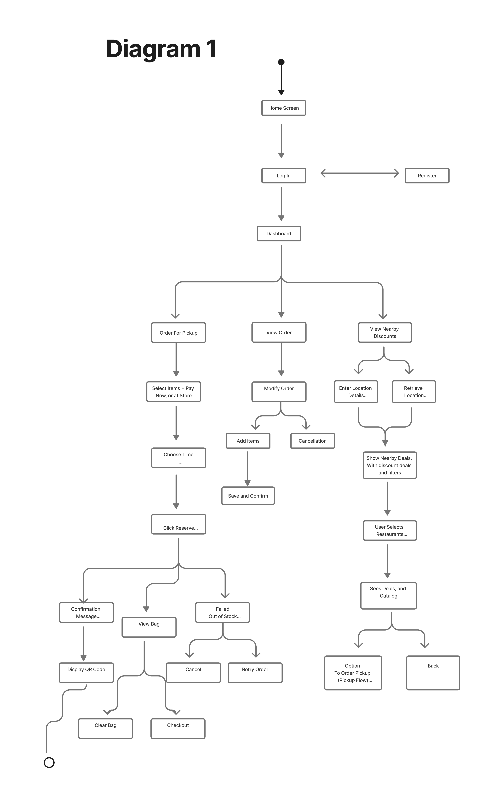
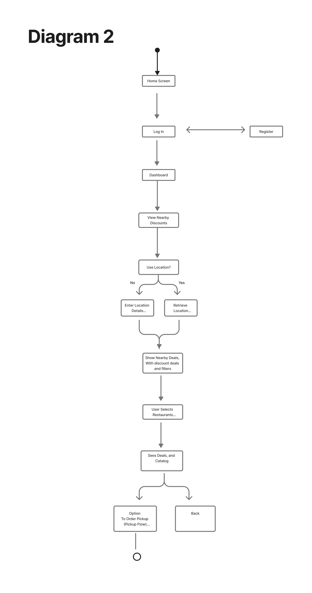

#  Specification Phase Exercise

A little exercise to get started with the specification phase of the software development lifecycle. See the [instructions](instructions.md) for more detail.

## APP name 

## Team members

[Ethan Demol](https://github.com/ethandemol)  
[Kyle Chen](https://github.com/KyleC55) 
[Angelina Wu](github.com/TangelinaWu) 
 
 

## Stakeholders

Primary Users- NYU Students

### Charlie Burke - NYU Student 
Budget-Constrained Commuter Student

**Student Goals** 
- Find affordable meals within his student budget
- Access consistent and reliable student discounts for everyday meals.
- Avoid overspending due to lack of clear pricing information.

**Student Problem** 
- Primarily discovering discounts through street signage or verbally, which is inconvenient and unreliable.
- Discount information is often not clearly advertised, including confusing restrictions, time limits, and eligibility rules.
- Current apps on the market like Too Good To Go do not fit his habitual needs having time crunches and only specials.

### Noelia Yang - NYU Student 
Overloaded Academic Students

**Student Goals** 
- Loves a good deal but wants convenient food options primarily to save time.
- Wants to quickly identify options near her that she can integrate into her daily routine.
- Needs to be close or she would rather waste money at the closest restaurants even if the price hurts.

**Student Problem** 
- After class, even if she knows a deal is there, because of convenience she would get something nearby, wasting money.
- Does not actively search for discounts, however would integrate it in their life if it was easier.
- Wants deals on certain paths between classes and doesn't want to deviate too much from her original daily paths.

### Benito Ramirez - NYU Student 
Exploratory Social Eater

**Student Goals** 
- Loves trying new food around him with friends.
- Discover good food worth the price, fit for different occasions (grab and go, sit down, coffee shops, etc.)
- Loves a good deal but will not sacrifice taste.

**Student Problem** 
- Current deals are not well displayed, leading him to often eat at restaurants without realizing they even had deals.
- Cannot find hidden gems leading him to default the same few restaurants; he is getting bored.

### Jessia Alba - NYU Student 
Health focused Student Athlete

**Student Goals** 
- Wants to locate healthy discounted food that is good for her performance.
- Avoid snacks and processed goods, focusing on natural options that don't break her wallet.

**Student Problem** 
- Limited discount visibility on nutritional options leading to her missing opportunities.
- Few healthy discounts she can find, leading her to just order CAVA daily.

### Derrick Li - Hashi Market 
**Restuarant Goals**  
Hashi Market already offers end-of-day discounts on ready-to-go products and provides student discounts, showing a clear effort to reduce food waste while remaining affordable. With multiple locations and an active social media presence, the brand is well positioned to attract student customers. A key overarching goal is to further minimize food waste while maintaining operational efficiency.

**Restaurant Problem** 
Despite these efforts, Hashi Market faces several operational challenges. Discounts are currently applied manually, which is time-consuming and limits scalability, especially during busy periods. The lack of an automated system also makes it difficult to quickly adjust or toggle discount codes on and off. Additionally, hiring remains a challenge, creating operational strain that indirectly affects waste reduction efforts.

### Tartinery 
**Restuarant Goals**  
Tartinery currently offers NYU students a discount of 10% as they want to promote students to come during the day, especially during the week when they're less busy. It's very important for them to maintain low food waste levels however they are doing a pretty good job of it currently and anything remaining is on Too Good To Go or goes directly to employees at the end of the day. 

**Restaurant Problem** 
Given that they already offer the NYU 10% discount and they have little food waste, Tartinery did not express to us many problems that need solving. However, they did mention that a lot of students don't realize the 10% discount and they have to ask them whether they're students to inform them of such.

See instructions. Delete this line and replace with the name(s) of the stakeholder(s) you interviewed and lists showing their goals/needs, and problems/frustrations.

### Overview 

From our interviews, we realized we needed to pivot from our original idea of a real-time, item-specific discounting system (where both students and restaurants would be active users) to a simpler, student-focused application that clearly displays existing student discounts at nearby restaurants (e.g 10% off at Tartinery). 

This was for two reasons. Firstly, many restaurants near NYU have little to no food waste and the restaurants that do have any waste already use platforms such as TooGoodToGo. The second reason was that many students wanted predictability and clarity. They don't want specific item discounts and they want to have a bit more clarity going into the day where they can get a good deal near Bobst rather than have to wait for sporadic notifications. 

As a result, our primary and sole user is now the NYU student, and the application is designed to help them quickly and easily discover nearby student discounts.

**Goals** 
1. Quickly find student discounts near campus.
2. Save money on everyday meals.
3. Minimize time spent deciding where to eat.
4. Discover new restaurants close to campus.

**Frustrations** 
1. Lack of centralized information about discounts.
2. Awkwardness of asking for discounts in person.
3. Over-reliance on familiar food spots.
4. Dislike of unpredictable or pre-payment discount models such as TooGoodToGo.

## Product Vision Statement

A mobile app that helps NYU students quickly discover nearby restaurants offering student discounts, view the discount details, and navigate to the best option based on distance and preference.

## User Requirements
1. As an NYU student, I want to see nearby restaurants that offer student discounts so that I can save money on meals.
2. As an NYU student, I want to quickly find the nearest discount around Bobst so that I can save time deciding where to eat.
3. As an NYU student, I want to view discount details before going to a restaurant so that I know exactly what I’m getting.
4. As an NYU student, I want to see specific discounted items rather than mystery offers so that I can choose food I actually want.
5. As an NYU student, I want discounts to be clearly labeled as student discounts so that I don’t feel awkward asking at the register.
6. As an NYU student, I want to filter restaurants by distance so that I don’t have to walk too far for a deal.
7. As an NYU student, I want to filter discounts by time of day so that I can find deals that fit into my schedule.
8. As an NYU student, I want to discover new restaurants near campus so that I don’t always eat at the same places.
9. As an NYU student, I want the app to show only restaurants near campus so that the information feels relevant and useful.
10. As an NYU student, I want the app to be simple and fast to use so that finding a discount doesn’t feel like extra work.
11. As an NYU student, I want to reserve or order discounted and promotional items, including coupons, so I can secure the deal and pick up my order later before the items sell out.
12. As an NYU student, I want to view nearby restaurants and markets that offer discounts or special deals on specific food items, so I can quickly choose a convenient location and know exactly what I am purchasing before pickup.

## Activity Diagrams
**User Story:**  
As a student user, I want to reserve or order discounted and promotional items, including coupons, so I can secure the deal and pick up my order later before the items sell out.

## UML Activity Diagram 2 . Nearby Discounts

**User Story:**  
As a student user, I want to view nearby restaurants and markets that offer discounts or special deals on specific food items, so I can quickly choose a convenient location and know exactly what I am purchasing before pickup.

## Clickable Prototype

**[Clickable Prototype](https://www.figma.com/proto/JxEQS6iTELe9u8KcojCFyC/Otters---Wireframe---Prototype?node-id=23-3&p=f&t=4Mx8STc7zvDBF5pH-1&scaling=scale-down&content-scaling=fixed&page-id=0%3A1&starting-point-node-id=23%3A3):**  
Link To Prototype: 
https://www.figma.com/proto/JxEQS6iTELe9u8KcojCFyC/Otters---Wireframe---Prototype?node-id=23-3&p=f&t=4Mx8STc7zvDBF5pH-1&scaling=scale-down&content-scaling=fixed&page-id=0%3A1&starting-point-node-id=23%3A3